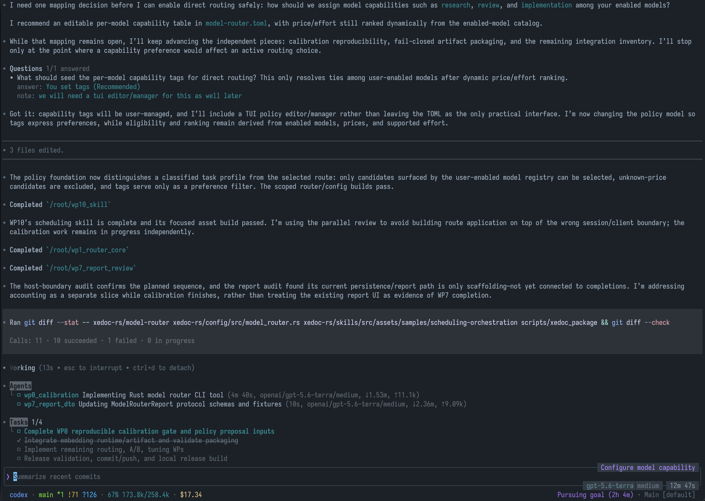

# Xedoc

Xedoc is a terminal-first coding agent for teams that want to choose their
models and providers without giving up coordinated agent workflows.



## Highlights

- **Cross-provider subagents** — assign a child agent a different configured
  provider or model, while retaining one shared task and conversation.
- **Cost and token visibility** — shows usage and configured USD pricing for
  the session, including live child-agent work. Unpriced models remain
  unestimated.
- **Multi-agent control** — monitor active agents, their provider/model
  metadata, runtime, and usage; nesting depth is configurable and enforced.
- **Persistent task tracking** — keeps the active plan above the prompt with
  clear pending, active, and complete states.
- **Thread-scoped plugin context** — plugins can provide persistent instruction
  blocks with precise placement around repository instructions; subagents
  inherit that context.
- **Terminal productivity** — file-path completion, session names, custom
  status lines, and a focused terminal UI.

## Install

```shell
curl -fsSL https://raw.githubusercontent.com/apohl79/codex/main/scripts/install/install.sh | sh
```

## Project resources

- [Feature inventory](README.fork.md)
- [Contributing](docs/contributing.md)
- [License](LICENSE)
