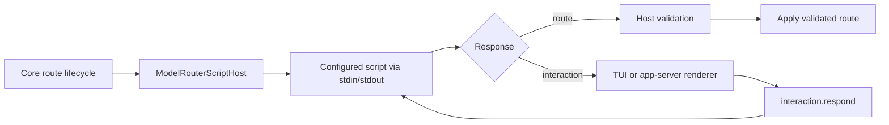

# Scripted model-routing architecture

This document defines Xedoc's sole model-router architecture. A configured local
script owns router policy, classification, route selection, settings structure,
and approval content. Xedoc remains the validated interaction host: it manages
process lifecycle and turn state, renders constrained UI surfaces, and applies
only eligible routes.

## Table of contents

- [Design goals](#design-goals)
- [Ownership boundary](#ownership-boundary)
- [Configuration](#configuration)
- [Settings lifecycle](#settings-lifecycle)
- [Protocol](#protocol)
  - [Settings](#settings)
  - [Generic interactions](#generic-interactions)
  - [Routing decisions](#routing-decisions)
- [Validation and failure behavior](#validation-and-failure-behavior)
- [Integration shape](#integration-shape)
- [Execution plan](#execution-plan)

## Design goals

- Support exactly one router implementation: the configured script. Xedoc has
  no built-in classifier, ranker, decision engine, or approval-policy fallback.
- Use a short-lived, JSON-over-stdio command contract shaped like the existing
  status-line command.
- Make `/model-router` a script-driven settings surface: the script supplies
  menus, values, descriptions, models, policies, and action handling.
- Let the script decide whether a routing choice needs approval, then supply
  the approval text and override choices that Xedoc renders.
- Keep routing available from all existing clients, not only the TUI.
- Preserve Xedoc's authority over mutable turn state, model eligibility,
  cancellation, error handling, and diagnostics.

## Ownership boundary

The script owns:

- Model catalog presentation, routing policy, classification, and route
  selection.
- Router settings persistence and settings-menu structure.
- Whether a route needs approval.
- Approval copy, options, override choices, and interpretation of user answers.

Xedoc owns:

- Process lifecycle, timeout, cancellation, stderr diagnostics, and
  output-size limits.
- Rendering a constrained declarative UI.
- Turn lifecycle and applying a route only after validation against Xedoc's
  currently eligible provider/model catalog.
- Preserve the current route if the script fails, times out, or proposes an
  invalid route. This is host failure handling, not an alternate router.

This replaces the current split implementation:

- Routing logic is in [the core model-router adapter](../../xedoc-rs/core/src/model_router.rs:62).
- TUI policy menus are in [the chat-widget policy view](../../xedoc-rs/tui-chatwidget/src/chatwidget/model_router_policy.rs:8).
- Model-router approval has its own [bottom-pane overlay](../../xedoc-rs/tui-overlays/src/bottom_pane/model_router_approval.rs:31).
- Status-line commands show the desired one-request/one-response subprocess
  shape in [the status-line executor](../../xedoc-rs/tui-status/src/status_line_command.rs:21).

## Configuration

Keep host-side configuration deliberately small and user-owned:

```toml
[model_router]
script = ["~/.xedoc/scripts/model-router"]
decision_timeout_ms = 3000
interaction_timeout_ms = 10000

[model_router.context]
recent_messages = 8
max_recent_message_bytes = 24576
```

`script` is argv, not a shell string. This avoids quoting and shell-injection
ambiguity. There is no built-in backend or migration fallback: every
model-router decision and interaction is script-owned.

The script persists its own policy and settings. Xedoc does not attempt to
translate arbitrary script settings back into `config.toml`.

### Required settings parity

The initial scripted settings contract must expose every setting and action
required by the model-router product:

| Setting or action | Choices or behavior | Scripted menu requirement |
| --- | --- | --- |
| Mode | `off`, `shadow-subagents`, `shadow-full`, `subagents`, `full` | Render the current value and these choices (or a script policy's equivalent choices). |
| Approval prompts | `off`, `changes`, `all` | Render the current value and its policy-specific choices. |
| Routing feedback | On/off toggle | Render the current value and a change action. |
| A/B test | Arm next; disable | Render both commands when supported by the script policy. |
| Open routing report | Opens the local decisions, cost, and A/B report | Return an explicit host action, rather than a file path or arbitrary command. |
| Policy manager | Opens confidence, model ladder, and reporting-baseline settings | Render a nested menu or an equivalent script-defined form. |
| Bootstrap policy | Writes the bundled initial policy when no user policy exists | Expose only when the script can perform this initialization. |

The scripted policy manager must contain:

| Policy item | Current choices or behavior |
| --- | --- |
| Confidence | `Strict` (0.50 / 0.15), `Balanced` (0.35 / 0.08), or `Permissive` (0.20 / 0.04) for minimum score/margin. |
| Model ladder | Each ranked slot chooses an eligible provider/model and a reasoning effort supported by that model. |
| Reporting baseline | `Not set` or one route from the ranked model ladder. |

The script receives the host's eligible model catalog. It can show only a
subset or organize it differently, but an initial parity script should render
the same selectable modes, approval policy, feedback toggle, A/B controls,
report action, confidence presets, ladder routes/efforts, and reporting
baseline.

## Settings lifecycle

Settings have one explicit round trip for every user action. Xedoc never
calculates a next settings state or writes a script-owned setting.

1. The user enters `/model-router`. Xedoc invokes `settings.open` and includes
   renderer capabilities, the current route, and the current eligible model
   catalog.
2. The script reads its persisted settings and returns a `menu` interaction
   with an opaque `continuation` token and a `stateRevision`. Xedoc renders
   that menu exactly as returned.
3. The user opens or changes a setting. For example, choosing **Approval
   prompts** opens a script-provided enum form, while choosing **Reporting
   baseline** opens a script-provided model-route form whose options are
   derived from the host catalog.
4. The user submits a choice. Xedoc invokes `interaction.respond` with the
   continuation token, interaction ID, action ID, field values, and the
   rendered state revision.
5. The script validates the action against its current settings, persists the
   update atomically, and returns the complete replacement surface with its new
   state revision. It may return a nested menu, the parent menu, a notice, or
   a validation error.
6. Xedoc validates only the response shape and any host-defined model route,
   replaces the active view with the returned surface, and does not mutate
   `config.toml`. If the script rejects the update or returns an error, Xedoc
   keeps the last rendered surface and shows the returned error.

For the two requested examples:

| User action | `interaction.respond` values | Script work | Returned surface |
| --- | --- | --- | --- |
| Set approval from `changes` to `all` | `{ "approval": "all" }` | Validate the enum and persist its approval policy. | The refreshed Model router menu with `Approval prompts: all`. |
| Set reporting baseline to `openai/gpt-5.6/high` | `{ "route": { "providerId": "openai", "model": "gpt-5.6", "reasoningEffort": "high" } }` | Verify the route was offered, persist it in the ranking policy, and update any related report state. | The refreshed policy menu with the selected reporting baseline. |

`stateRevision` prevents stale interactions. If another settings action has
already changed the script state, the script returns a conflict notice plus the
newest complete menu; Xedoc does not attempt a local merge.

## Protocol

Each command invocation receives one JSON document on stdin and returns one JSON
document on stdout:

```json
{
  "protocol": "xedoc.script/v1",
  "requestId": "01J...",
  "extension": "model-router",
  "method": "routing.decide",
  "context": { "...": "host-owned, bounded context" },
  "params": { "...": "method-specific input" }
}
```

Responses are either a route result, an interaction to render, or an explicit
structured error:

```json
{
  "protocol": "xedoc.script/v1",
  "requestId": "01J...",
  "result": { "kind": "route", "...": "..." }
}
```

```json
{
  "protocol": "xedoc.script/v1",
  "requestId": "01J...",
  "result": { "kind": "interaction", "...": "..." }
}
```

```json
{
  "protocol": "xedoc.script/v1",
  "requestId": "01J...",
  "error": { "code": "invalid_request", "message": "..." }
}
```

`stderr` is diagnostic-only and never interpreted as protocol data. The host
caps stdin, stdout, stderr, and wall-clock duration. It retains causal,
prompt-free diagnostics when an invocation fails.

### Settings

`/model-router` calls `settings.open`:

```json
{
  "method": "settings.open",
  "context": {
    "client": {
      "kind": "tui",
      "surfaces": ["menu", "form", "confirmation"]
    },
    "eligibleRoutes": [
      {
        "providerId": "openai",
        "model": "gpt-5.6",
        "reasoningEfforts": ["low", "medium", "high"]
      }
    ],
    "currentRoute": {
      "providerId": "openai",
      "model": "gpt-5.6",
      "reasoningEffort": "medium"
    }
  },
  "params": {}
}
```

The script responds with a declarative interaction:

```json
{
  "result": {
    "kind": "interaction",
    "interaction": {
      "id": "router-settings",
      "continuation": "opaque-script-state",
      "surface": {
        "type": "menu",
        "title": "Model router",
        "subtitle": "Balanced policy",
        "items": [
          {
            "id": "mode",
            "label": "Mode: full",
            "description": "Choose the router operating mode.",
            "action": { "id": "open-mode" }
          },
          {
            "id": "approval",
            "label": "Approval prompts: changes",
            "description": "Choose when decisions need confirmation.",
            "action": { "id": "open-approval-policy" }
          },
          {
            "id": "feedback",
            "label": "Routing feedback: on",
            "description": "Show concise router-decision history entries.",
            "action": { "id": "set-feedback", "value": false }
          },
          {
            "id": "ab",
            "label": "A/B test",
            "description": "Arm or disable the next eligible experiment.",
            "action": { "id": "open-ab-controls" }
          },
          {
            "id": "report",
            "label": "Open routing report",
            "action": { "id": "open-report" }
          },
          {
            "id": "policy",
            "label": "Policy manager",
            "description": "Tune confidence, model ladder, and reporting baseline.",
            "action": { "id": "open-policy" }
          },
          {
            "id": "bootstrap",
            "label": "Bootstrap policy",
            "description": "Create the script's initial user policy.",
            "action": { "id": "bootstrap-policy" }
          },
          {
            "id": "default-model",
            "label": "Reporting baseline: gpt-5.6 / medium",
            "action": { "id": "choose-reporting-baseline" }
          }
        ]
      }
    }
  }
}
```

On selection, Xedoc invokes `interaction.respond`:

```json
{
  "method": "interaction.respond",
  "params": {
    "continuation": "opaque-script-state",
    "interactionId": "router-settings",
    "outcome": "accepted",
    "action": { "id": "open-approval-policy" },
    "values": {}
  }
}
```

The script performs any settings update and returns the replacement surface.
Thus, the script—not Xedoc—always produces the fresh settings menu after an
action.

### Generic interactions

Make interaction rendering generic within Xedoc, but expose it initially only
through the `model-router` capability. The supported surface vocabulary is
intentionally small:

- `menu`: selectable rows, optional current and disabled state.
- `form`: enum, boolean, bounded text, and model-route fields.
- `confirmation`: approve/reject and optional override controls.
- `notice`: non-interactive success or error information.

Every action and field uses a script-defined opaque identifier. The host returns
only:

```json
{
  "outcome": "accepted | cancelled | dismissed",
  "action": { "id": "..." },
  "values": { "field-id": "value-or-structured-value" }
}
```

Do not allow arbitrary HTML, terminal escape sequences, callbacks, or host
command execution. The small surface vocabulary is the reusable extension seam
for future scriptable Xedoc areas without becoming a general remote UI runtime.

### Routing decisions

For every eligible root or subagent turn, Xedoc calls `routing.decide` with
bounded context:

```json
{
  "method": "routing.decide",
  "context": {
    "turn": {
      "id": "turn-id",
      "scope": "root",
      "active": false,
      "routeMutable": true
    },
    "currentRoute": {
      "providerId": "openai",
      "model": "gpt-5.6",
      "reasoningEffort": "medium"
    },
    "eligibleRoutes": ["..."],
    "thread": {
      "id": "thread-id",
      "name": "optional name",
      "cwd": "/workspace/project",
      "tokenUsage": { "contextWindow": 128000, "used": 18300 }
    },
    "conversation": {
      "recentMessages": [
        { "role": "user", "text": "..." },
        { "role": "assistant", "text": "..." }
      ],
      "truncated": false
    }
  },
  "params": {
    "prompt": "new user or subagent prompt",
    "explicitRouteOverride": false
  }
}
```

Only user and final-assistant text belong in `recentMessages`; omit tool output,
secrets, approval payloads, and arbitrary transcript internals. The configured
message count and byte cap must be reflected in truncation metadata.

The script either returns an immediate route:

```json
{
  "result": {
    "kind": "route",
    "decision": {
      "id": "router-decision-id",
      "disposition": "apply",
      "route": {
        "providerId": "openai",
        "model": "gpt-5.6",
        "reasoningEffort": "high"
      },
      "summary": "Complex code change; use high reasoning."
    }
  }
}
```

…or requests approval:

```json
{
  "result": {
    "kind": "interaction",
    "interaction": {
      "id": "route-approval",
      "continuation": "opaque-script-state",
      "surface": {
        "type": "confirmation",
        "title": "Use gpt-5.6 high?",
        "body": "This task touches authentication and has a broad change surface.",
        "details": [
          { "label": "Current route", "value": "openai/gpt-5.6/medium" },
          { "label": "Proposed route", "value": "openai/gpt-5.6/high" },
          {
            "label": "Work type",
            "value": "group2: research, review, diagnosis, design"
          },
          { "label": "Confidence", "value": "0.71; margin 0.18" }
        ],
        "actions": [
          {
            "id": "approve",
            "label": "Use this route",
            "keyBindings": ["enter"]
          },
          {
            "id": "keep-current",
            "label": "Keep current route",
            "keyBindings": ["esc"]
          },
          {
            "id": "begin-override",
            "label": "Change classification",
            "keyBindings": ["o"]
          }
        ],
        "override": {
          "id": "classification-override",
          "title": "Override route classification",
          "submit": {
            "id": "submit-override",
            "label": "Preview override",
            "keyBindings": ["enter"]
          },
          "cancel": { "id": "cancel-override", "keyBindings": ["esc"] },
          "fields": [
            {
              "id": "work_type",
              "label": "Work type",
              "type": "select",
              "value": "group2: research, review, diagnosis, design",
              "options": [
                {
                  "id": "group0: question, docs_analysis, packaging, operational, testing",
                  "label": "Question, analysis, packaging, operations, or testing"
                },
                {
                  "id": "group1: implementation, bug_fix, refactor, docs_authoring, orchestration, calibration",
                  "label": "Implementation, fix, refactor, authoring, orchestration, or calibration"
                },
                {
                  "id": "group2: research, review, diagnosis, design",
                  "label": "Research, review, diagnosis, or design"
                }
              ]
            },
            {
              "id": "complexity",
              "label": "Complexity",
              "type": "select",
              "value": "high",
              "options": [
                { "id": "low", "label": "Low" },
                { "id": "medium", "label": "Medium" },
                { "id": "high", "label": "High" },
                { "id": "very_high", "label": "Very high" }
            ]
            },
            {
              "id": "orchestration",
              "label": "Orchestration",
              "type": "select",
              "value": "coordination",
              "options": [
                { "id": "none", "label": "None" },
                { "id": "delegate", "label": "Delegate" },
                { "id": "coordination", "label": "Coordination" },
                { "id": "workflow", "label": "Workflow" }
              ]
            },
            {
              "id": "risk",
              "label": "Risk",
              "type": "select",
              "value": "high",
              "options": [
                { "id": "low", "label": "Low" },
                { "id": "medium", "label": "Medium" },
                { "id": "high", "label": "High" }
              ]
            }
          ]
        }
      }
    }
  }
}
```

This is the current approval prompt in declarative form: all visible copy,
current/proposed route details, button labels, allowed key bindings, override
field labels, and every category value come from the script. The category IDs
above are examples; the script supplies the actual axes and allowed values for
its active policy. Xedoc validates only the constrained surface schema and
honors bindings that the host advertised as available; it never invents a
category, a model option, or a shortcut.

Approval follows a two-stage interaction:

1. Xedoc renders the returned confirmation surface. **Enter** accepts,
   **Esc** keeps the current route, and **O** opens the returned override form
   when those bindings were advertised by both host and script.
2. Xedoc returns the selected action through `interaction.respond`. For an
   override submission it returns every selected category value, for example:

   ```json
   {
     "outcome": "accepted",
     "action": { "id": "submit-override" },
     "values": {
       "work_type": "group2: research, review, diagnosis, design",
       "complexity": "high",
       "orchestration": "coordination",
       "risk": "high"
     }
   }
   ```

3. The script recomputes the route from those values and returns either a
   refreshed approval surface with the new proposed route or a `route` result.
   Only that subsequent, validated `route` response can apply a model change.

For an active root turn, Xedoc sets `active: true` and `routeMutable: false`.
The script may classify or report that input, but Xedoc must reject an attempt
to mutate the model. Active steering cannot reroute the turn in place.

`routeMutable` is a host-owned guard, not a router setting or a permission the
script may grant itself:

| Value | When Xedoc sets it | Consequence |
| --- | --- | --- |
| `true` | A newly accepted root turn before its model request starts, or a subagent before it is spawned. | A valid script route may replace the pending turn's model, provider, and reasoning effort. |
| `false` | A user message is steering an already active root turn, or the pending request has otherwise become immutable. | The script may return a no-change decision or diagnostics, but any route-change result is rejected and the current route is retained. |

This field tells the script why an otherwise eligible route cannot be applied.
It preserves the existing active-turn steering behavior while allowing the
script to produce useful reporting or feedback for that input.

## Validation and failure behavior

Before Xedoc applies any scripted route, it must:

1. Verify the decision belongs to the pending turn and has not expired.
2. Verify provider, model, and reasoning effort are in the host-supplied
   eligible catalog.
3. Verify the turn remains mutable.
4. Atomically update model, provider, and reasoning effort. If provider or
   model changes, preserve the existing full-history replay behavior.
5. Emit a compact transcript/app-server decision event with the script decision
   ID and summary, but never raw prompt or context.

On malformed JSON, timeout, cancellation, invalid route, or other script
failure:

- Keep the original route.
- Continue the turn unless the script explicitly returned a valid blocking
  interaction.
- Emit prompt-free causal diagnostics.

## Integration shape

Put protocol types and the subprocess executor in a small
`xedoc-script-protocol` crate rather than adding them to the already large core
crate.



The TUI can adapt its existing generic selection surface rather than retaining
router-specific policy-menu logic. The app-server should add one generic
extension-interaction server request/response pair instead of growing the
current router-specific approval contract.

### Codebase integration points

The change crosses the following concrete boundaries. The implementation
replaces the router-specific path; no built-in decision or approval path remains
as a compatibility fallback.

| Area | Existing integration point | Scripted-router change |
| --- | --- | --- |
| User configuration | [`ModelRouterConfigToml`](../../xedoc-rs/config/src/model_router.rs:93) and the effective feature-gated config in [`core-config`](../../xedoc-rs/core-config/src/config/mod.rs:616) | Configure the direct-exec argv command and host limits. Script-owned settings stay outside `config.toml`; no backend selector is exposed. |
| Script runtime | [`run_status_line_command`](../../xedoc-rs/tui-status/src/status_line_command.rs:21) is the closest current one-shot stdin/stdout process runner. | Add `xedoc-script-protocol` plus a reusable core-side subprocess executor with request/response schemas, caps, timeout, cancellation, and prompt-free stderr diagnostics. Do not reuse TUI-only status-line code directly. |
| Root routing | [`ModelRouterService::decide_root`](../../xedoc-rs/core/src/model_router.rs:124) is reached from [`root_shadow_routing::decide_for_accepted_input`](../../xedoc-rs/core/src/session/root_shadow_routing.rs:15). | Route every decision through the script host, while retaining host route validation and turn mutation in core. |
| Active-turn steering | [`steering_bypass_root`](../../xedoc-rs/core/src/model_router.rs:164) is called by the root-routing helper for an active turn. | Send `active` and `routeMutable: false` to the script, but preserve the host bypass: a script result cannot mutate an active turn. |
| Root approval and resume | [`session/handlers.rs`](../../xedoc-rs/core/src/session/handlers.rs:333) decides whether to park an input behind a router approval. | Generalize its pending approval record into a pending scripted interaction that retains the original operation, turn ID, expiry, and continuation token. Resume only after a validated script route result. |
| Subagent routing | [`multi_agents_v2/spawn.rs`](../../xedoc-rs/core/src/tools/handlers/multi_agents_v2/spawn.rs:101) decides and approves a route before spawning. | Route it through the same script host and generic pending-interaction machinery; preserve its pre-spawn route validation and rollback path. |
| Core event boundary | [`Op::ModelRouterApprovalResponse`](../../xedoc-rs/protocol/src/protocol.rs:354) and the `ModelRouterDecision`/`ModelRouterApprovalRequest` events ([`protocol.rs`](../../xedoc-rs/protocol/src/protocol.rs:1038)) are router-specific. | Add bounded generic scripted-interaction request/response events with extension ID, interaction ID, opaque continuation, constrained surface, and submitted values. Keep router decision telemetry distinct and prompt-free. |
| App-server v2 schema | Current policy APIs are in [`common.rs`](../../xedoc-rs/app-server-protocol/src/protocol/common.rs:815); router approval is the server request at [`common.rs`](../../xedoc-rs/app-server-protocol/src/protocol/common.rs:1396). | Add an experimental generic extension-interaction server request/response in `app-server-protocol`, with generated TypeScript. Migrate model-router approval to it only after the TUI can render the generic surface. |
| App-server event bridge | [`bespoke_event_handling.rs`](../../xedoc-rs/app-server/src/bespoke_event_handling.rs:337) maps core approval events to client requests and maps replies back around line 1698. | Add mappings for the generic interaction request and response, resolving only the matching pending request. This keeps non-TUI clients on the same flow. |
| TUI settings | [`slash_dispatch.rs`](../../xedoc-rs/tui-chatwidget/src/chatwidget/slash_dispatch.rs:174) builds the hard-coded top-level menu and [`model_router_policy.rs`](../../xedoc-rs/tui-chatwidget/src/chatwidget/model_router_policy.rs:8) builds policy submenus. | `/model-router` becomes one `settings.open` request; map its returned declarative menu/form/notice to existing generic selection/form views. Remove hard-coded router settings only after the script menu reaches parity. |
| TUI event dispatch | [`event_dispatch.rs`](../../xedoc-rs/tui/src/app/event_dispatch.rs:1125) maps router-specific `AppEvent`s to local settings and app-server calls. | Replace the mode/approval/policy-specific branch set with `ScriptInteractionRequested` and `ScriptInteractionSubmitted` events that forward opaque action IDs and values. |
| TUI approval | [`model_router_approval.rs`](../../xedoc-rs/tui-overlays/src/bottom_pane/model_router_approval.rs:31) currently owns router-specific keys, classifications, and preview logic. | Replace it with a generic constrained interaction renderer. The script supplies labels, bindings, axes, values, and recomputed preview; the TUI supplies only navigation and submission. |
| Host-owned report and A/B actions | The TUI opens reports through [`config_update.rs`](../../xedoc-rs/tui/src/config_update.rs:234); app-server report handling and A/B control remain in [`model_router_report_server.rs`](../../xedoc-rs/app-server/src/model_router_report_server.rs:38) and [`thread_processor.rs`](../../xedoc-rs/app-server/src/request_processors/thread_processor.rs:443). | Treat `open-report`, `arm-ab`, and `disable-ab` as explicit, allow-listed host actions returned by a script menu. Do not let a script return an arbitrary URL, shell command, or RPC method. |

The workspace already lists [`xedoc-model-router`](../../xedoc-rs/Cargo.toml:271)
as a first-party dependency. Add the new protocol/runtime crate to the same
workspace and its Bazel targets, but do not place general extension machinery
in `xedoc-core`.

## Execution plan

The target is reached in these dependency-ordered stages. Each stage leaves no
second router path: the script remains the sole source of routing policy and
interaction content.

1. **Generic pending scripted-interaction lifecycle in core.** Introduce the
   bounded pending-operation record, continuation validation, expiry,
   cancellation, and safe resumption machinery. It must preserve root and
   subagent operation semantics without embedding router policy.
2. **Generic app-server request/response bridge.** Add the experimental v2
   request and response surface that relays a constrained scripted interaction
   to every connected client and resolves only its matching pending
   interaction.
3. **Generic TUI renderer for menu, form, and confirmation.** Render the
   declarative constrained surfaces, submit opaque action IDs and values, and
   remove router-specific UI logic as the generic renderer reaches parity.
4. **Scripted settings and scripted route approval on that lifecycle.** Route
   `/model-router`, route approvals, overrides, and re-classification after an
   override through the configured script and generic lifecycle. Remove the
   legacy router-specific policy editor and approval path.
5. **Reference script, ranking, packaging, then the tmux matrix.** Implement
   the bundled reference script according to
   [`docs/ranking-system.md`](../ranking-system.md), package and ship it with
   Xedoc, then run the requested focused tmux matrix: every `/model-router`
   item and config update; all router modes; approval, override, and
   re-classification flows for every changed category; and feedback on/off with
   script-provided classification, confidence, routing/rating calculation, and
   chosen model details.
