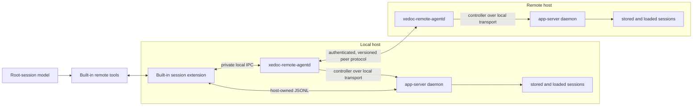
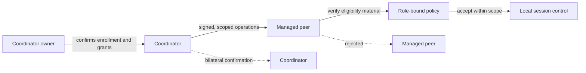
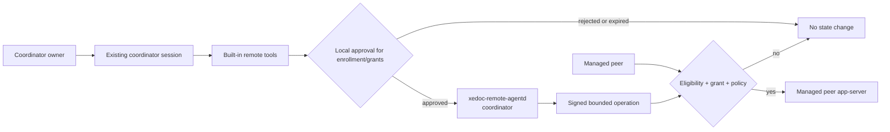
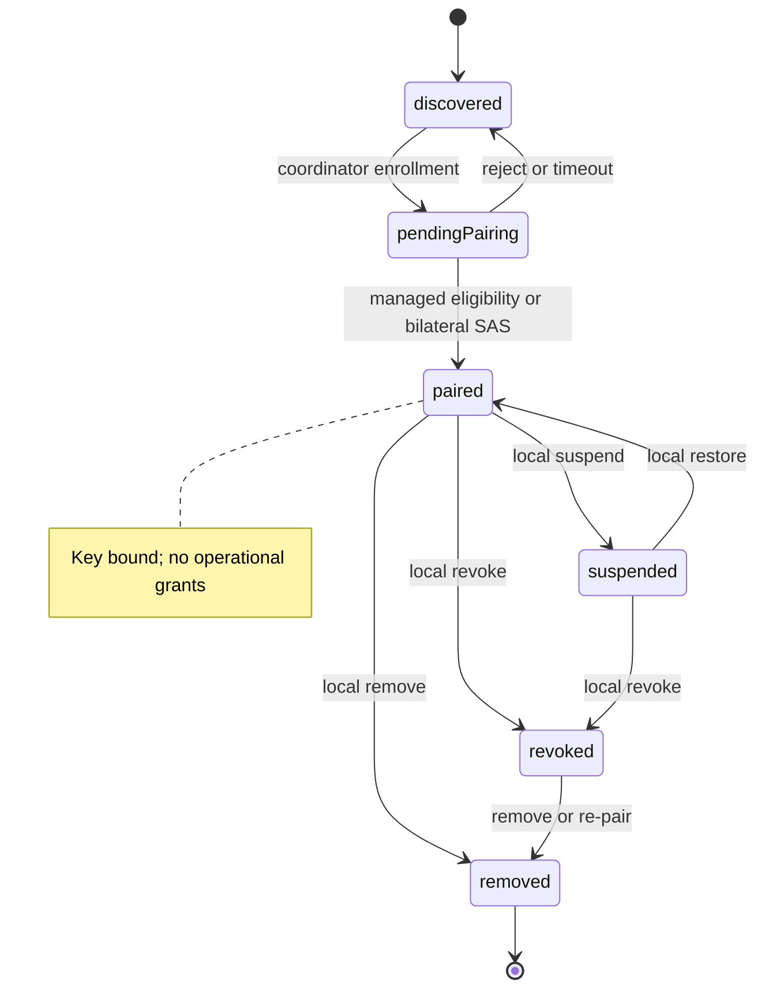
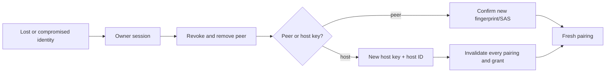
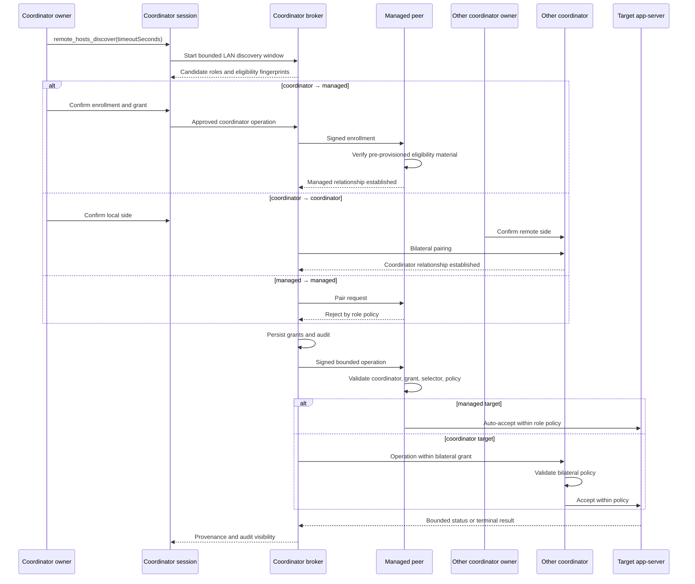
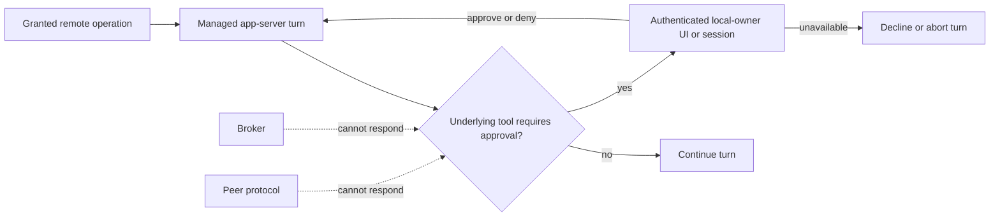

# Remote Agent Capabilities: Staged Implementation Spec

**Status:** proposed implementation plan
**Primary deliverable:** `xedoc-remote-agentd`, a Python host broker bundled
with Xedoc.

## Outcome

Xedoc will support trusted, local-network remote agents without exposing an
app-server listener to the LAN. Each host runs `xedoc-remote-agentd`; it owns
peer transport and uses a normal, local app-server controller connection for
host-wide session control. A built-in extension exposes bounded remote tools in
every root Xedoc session.

The work ships in six stages. Each stage is independently usable, has a
defined security boundary, and does not require a new host-scoped app-server
API.

## Table of contents

- [Fixed decisions and boundaries](#fixed-decisions-and-boundaries)
- [Target architecture](#target-architecture)
- [Trust lifecycle and human authority](#trust-lifecycle-and-human-authority)
- [Shared contracts](#shared-contracts)
- [Delivery stages](#delivery-stages)
  - [Stage 0: end-to-end test harness](#stage-0-end-to-end-test-harness)
  - [Stage 1: local controller transport](#stage-1-local-controller-transport)
  - [Stage 2: local host broker](#stage-2-local-host-broker)
  - [Stage 3: built-in model tools](#stage-3-built-in-model-tools)
  - [Stage 4: trusted LAN read plane](#stage-4-trusted-lan-read-plane)
  - [Stage 5: trusted LAN control plane](#stage-5-trusted-lan-control-plane)
  - [Stage 6: agent messaging and release hardening](#stage-6-agent-messaging-and-release-hardening)
- [Cross-stage rules](#cross-stage-rules)
- [Deferred work](#deferred-work)

## Fixed decisions and boundaries

### Required

- `xedoc-remote-agentd` is a Python process, bundled and versioned with the
  Xedoc release.
- The broker is the only LAN-facing process. It never proxies raw app-server
  JSON-RPC or its controller socket.
- On Linux and macOS, the broker connects to app-server through
  `--listen unix://` and a Unix-domain socket. The SDK must make that a normal
  controller transport, reusing the framing proven by
  [`scripts/xedoc-session`](../../scripts/xedoc-session:1-80).
- The built-in remote extension is active in every root session. Its model
  tools are registered before the first model turn and remain bound to the
  built-in payload identity.
- Local workspaces are an explicit allowlist. A remote caller supplies a
  workspace ID and an optional relative path, never an arbitrary `cwd`.
- Every remote session identity is `{hostId, threadId}`. Thread IDs alone are
  never globally unique.
- Every broker has a relationship role: `coordinator` or `managed`. A
  coordinator owner confirms enrollment and grants; a managed peer accepts
  only authenticated coordinator operations within its role policy.
- Model-facing actions are bounded and return handles. Waiting for progress or
  terminal output is a separate, bounded operation.

### Explicit exclusions

- Do not add a host-scoped app-server capability.
- Do not expose app-server TCP/WebSocket on the LAN.
- Do not reuse the removed `remoteControl/*` or attestation interfaces.
- Do not introduce a generic `remote_rpc` model tool.
- Do not grant a remote peer authority to approve local shell, filesystem,
  network, MCP, sandbox, or permission prompts.
- Do not grant the broker or peer protocol authority to answer an app-server
  approval raised by a remote-originated turn.
- Embedded-TUI app-server mode does not support host-wide remote control in
  this plan. The daemon-backed controller is required.

### Existing surfaces to reuse

- The scripting SDK already normalizes controller-only list, search, start,
  and resume operations, including `cwd`, `isRunning`, and `lastActivity`
  ([SDK controller contract](../../scripts/session_script_sdk.md:507-543)).
- App-server v2 already exposes the required `thread/*` control surface
  ([thread protocol](../../xedoc-rs/app-server-protocol/src/protocol/v2/thread.rs:56-1088)).
- Dynamic tool calls already travel as `item/tool/call`
  ([server request](../../xedoc-rs/app-server-protocol/src/protocol/common.rs:1443-1448)).
- The current session-extension manager is plugin-discovered and activates
  extensions asynchronously ([manager](../../xedoc-rs/app-server/src/session_extension_manager.rs:145-194)).
  It cannot satisfy the built-in, pre-first-turn readiness contract without a
  new built-in provider path.

## Target architecture



The process boundaries are intentional:

| Component | Owns | Must not own |
| --- | --- | --- |
| App-server | local threads, turns, approvals, sandbox policy | LAN discovery, peer identity, peer authorization |
| `xedoc-remote-agentd` | host catalog, peer protocol, grants, routing, bounded relays | raw remote app-server access or local approval decisions |
| Built-in extension | model-tool schemas, source-session identity, local broker calls | host-wide controller authority or peer credentials |
| Remote peer | requests within its grant | arbitrary paths, settings overrides, source identity, approvals |

## Trust lifecycle and human authority

### Roles and enrollment



The roles are relationship-scoped:

| Role | Can enroll | Human confirmation | Operation behavior |
| --- | --- | --- | --- |
| **Coordinator** | Managed peers, or another coordinator with bilateral confirmation | Required on the coordinator for enrollment and grant changes; also required on the other coordinator for coordinator-to-coordinator pairing | May issue operations covered by its active grants |
| **Managed peer** | None | Not required for each operation | Accepts only authenticated, coordinator-authorized operations covered by its local role policy |

A managed peer must have pre-provisioned coordinator eligibility material:
an allowed coordinator fingerprint/public key, a one-time enrollment credential,
or an equivalent local allowlist. Enrollment proves both the coordinator
identity and its role; a LAN actor cannot claim to be a coordinator. Multiple
coordinators may independently enroll the same managed peer, with separate
keys, grants, audit trails, and revocation. Managed-to-managed pairing is
always rejected.

### Authority model



The coordinator owner controls enrollment, grants, revocation, and recovery.
After a managed peer is enrolled, operations within the coordinator's active
grant and the managed peer's role policy do not prompt the managed peer's
owner. Operations outside that policy are rejected, not escalated remotely.
Coordinator-to-coordinator relationships require local confirmation on both
coordinators before either can issue operations. A peer, broker client, model
output, or earlier approval cannot supply a missing enrollment or grant
decision.

### Peer and grant state



- `discovered` is an ephemeral candidate returned by an active discovery
  window; it is not a standing trust grant.
- Coordinator-to-managed enrollment needs coordinator-local confirmation plus
  managed-peer eligibility material. Coordinator-to-coordinator pairing needs
  local confirmation on both sides. Managed-to-managed is rejected.
- A grant binds relationship + host + scopes + optional workspace/session
  selector + actor + timestamps + expiry.
- Enrollment grants no operation. `workspaceRead`, `sessionRead`,
  `sessionWrite`, and `cancellation` are explicit and non-transitive.
- Write and cancellation always expire. Durable read requires explicit owner
  confirmation. Only the latest audited grant revision is active.
- Suspension blocks new work and detaches relays. Revocation also invalidates
  pending requests and handles. Neither silently cancels a running turn.
- A managed peer accepts a request only when the coordinator signature,
  enrollment binding, grant, selector, and role policy all match. A
  coordinator may not use a managed peer as a bridge to another peer.

### Key rotation and compromise recovery



Recovery is local-only. Peer rotation suspends the old binding until new
fingerprint/SAS confirmation. Host recovery invalidates all pairings and
grants; local sessions and rollouts survive. Keys, grants, and host capability
remain owner-only under `XEDOC_HOME` (using the OS secret store when
available). The bounded local audit retains redacted event, actor/peer, scope,
operation, result, and reason for `audit_retention_days`; peers cannot read or
delete it.

### Human-controlled journeys



`remote_hosts_discover`, `remote_host_pair`, and `remote_host_grant_set`
cover trust setup. `remote_request_review`, `remote_request_approve`, and
`remote_request_reject` cover prompted operations. `remote_session_status`,
`remote_session_wait`, `remote_session_cancel`, `remote_host_suspend`, and
`remote_host_revoke` cover monitoring and intervention. Rejection, timeout,
or revocation leaves app-server untouched. A managed target does not prompt its
owner for an operation that passes coordinator authentication, grant, and
role-policy checks; an operation outside those checks is rejected.

## Shared contracts

### Local configuration

The broker starts from a host-only bootstrap descriptor at
`$XEDOC_HOME/remote-agent/bootstrap.toml`. The installer or launcher writes
the local controller endpoint there; it is not read from Xedoc configuration.
After connecting, the broker reads the effective host configuration from Xedoc
with `config/read` and no `cwd`, rather than accepting a remote configuration
update.

```toml
[remote_agent]
role = "coordinator" # or "managed"

[remote_agent.workspaces]
backend = "/Users/me/work/backend"
infrastructure = "/Users/me/work/infrastructure"

[remote_agent.limits]
max_attached_sessions = 8
max_message_bytes = 16384
max_result_bytes = 65536
max_wait_seconds = 120
max_discovery_seconds = 10
audit_retention_days = 90
```

On first installation, or when upgrading from a release without
`remote_agent.role`, the installer asks the user to choose `coordinator` or
`managed` and persists that choice. It must not silently assign a role.

```toml
# $XEDOC_HOME/remote-agent/bootstrap.toml
controller = "unix:///absolute/path/to/app-server.sock"
```

The configuration implementation must:

1. validate workspace IDs and canonicalize every configured root;
2. reject duplicate canonical roots and inaccessible roots at broker startup;
3. canonicalize a requested relative path and reject traversal and symlink
   escapes;
4. keep controller endpoints, key material, peer grants, and broker IPC paths
   local-only;
5. update [`xedoc-rs/core/config.schema.json`](../../xedoc-rs/core/config.schema.json:1)
   when `ConfigToml` changes.
6. require managed peers to configure coordinator eligibility material before
   accepting enrollment; changing `role` invalidates incompatible grants.
7. reject controller endpoint, role, and workspace allowlist values from
   project configuration layers. The bootstrap descriptor and `config/read`
   call have no project `cwd`.

For Windows, Stage 1 defines a local-only controller transport with equivalent
access restrictions. It must not make app-server reachable beyond loopback.
The broker protocol, workspace validation, and model-tool contracts remain
platform-independent.

### Broker API

The broker has two APIs:

- **private local IPC** for the built-in extension; authenticated by an
  instance-scoped capability created by the host; and
- **peer protocol** for paired brokers; mutually authenticated, encrypted, and
  versioned.

Both APIs use the same operation names and response shapes where possible.
The peer protocol adds peer identity and grant checks; it does not carry
app-server request objects.

Every response includes:

```json
{
  "hostId": "host_...",
  "requestId": "req_...",
  "status": "ok"
}
```

Errors use stable codes: `invalidRequest`, `unauthorized`, `notFound`,
`conflict`, `limitExceeded`, `unavailable`, and `internal`. They must not
contain filesystem paths or unbounded app-server errors unless the caller is
locally authorized to receive them.

### Session summary

`session/list` and `session/search` return a bounded page. A session result
always contains:

```json
{
  "hostId": "host_...",
  "threadId": "thr_...",
  "cwd": "/allowed/root/service",
  "isRunning": false,
  "lastActivity": 1760000000,
  "summary": {
    "title": "Fix release blocker"
  }
}
```

Search may add one bounded `snippet`. The broker derives `cwd`, `isRunning`,
and `lastActivity` from the SDK's normalized controller output; it does not
duplicate app-server session indexing.

### Operation inventory

| Operation | Read or mutation | Stage |
| --- | --- | --- |
| `host/describe`, `host/discover`, `host/pair` | control-plane | 4 |
| `host/grants/list`, `host/grants/set` | control-plane | 4 |
| `host/suspend`, `host/revoke`, `host/remove`, `host/rotate` | control-plane | 4, 6 |
| `workspace/list` | read | 2 local, 4 peer |
| `session/list`, `session/search` | read | 1 local, 4 peer |
| `session/start`, `session/resume` | mutation | 2 local, 5 peer |
| `session/attach`, `session/detach` | relay lifecycle | 2 local, 5 peer |
| `session/send`, `session/status`, `session/wait`, `session/cancel` | mutation/read | 2 local, 5 peer |
| `session/message` | mutation | 6 |
| `request/review`, `request/approve`, `request/reject` | local approval | 5 |

### Model-tool contract

The built-in extension exposes the same tool contract in a provider-compatible
shape. Providers with `namespace_tools` enabled receive a dedicated `remote`
namespace; flat-tool providers receive the uniquely prefixed `remote_*`
functions below. Both shapes preserve the same extension identity, dispatch,
and authorization semantics:

- `remote_hosts_list`
- `remote_hosts_discover`
- `remote_host_pair`
- `remote_host_grants_list`
- `remote_host_grant_set`
- `remote_host_suspend`
- `remote_host_revoke`
- `remote_host_remove`
- `remote_host_rotate`
- `remote_workspaces_list`
- `remote_sessions_list`
- `remote_sessions_search`
- `remote_session_start`
- `remote_session_resume`
- `remote_session_attach`
- `remote_session_send`
- `remote_session_message`
- `remote_session_status`
- `remote_session_wait`
- `remote_session_cancel`
- `remote_session_detach`
- `remote_request_review`
- `remote_request_approve`
- `remote_request_reject`

Read operations may complete synchronously within their fixed response limit.
`remote_hosts_discover` is an explicit bounded scan with a caller-provided
`timeoutSeconds` capped by `remote_agent.limits.max_discovery_seconds`; its
timeout returns candidates found so far and creates no peer or grant state.
Mutation operations return an `operationId` immediately. `remote_session_wait`
is the only tool that waits; it takes an `operationId` and an explicit timeout
bounded by `remote_agent.limits.max_wait_seconds`.

The extension derives the source `{hostId, threadId}` for
`remote_session_message`. Tool arguments never contain a caller-controlled
source identity.

## Delivery stages

### Stage 0: end-to-end test harness

**Goal:** establish the local validation environment before implementing remote
agent behavior.

**Scope**

1. Create a reusable end-to-end harness with separate `XEDOC_HOME` directories
   for a coordinator and a managed peer.
2. Support local agent-to-agent, session-to-session communication between those
   homes without requiring a LAN.
3. Run the extension integration path in real tmux sessions so tests exercise
   the actual model tools and human pairing flow.
4. Allow unit-level broker and protocol tests to mock Xedoc when that does not
   exercise extension integration.

**Exit criteria**

- The harness can launch isolated coordinator and managed-peer Xedoc instances,
  pair them through the human flow, and exchange a bounded session message.
- It captures enough terminal and broker output to diagnose a failed tool call,
  pairing action, or session relay.
- Every later stage extends these end-to-end scenarios for its newly available
  capability; mocked coverage does not replace the tmux integration path.

### Stage 1: local controller transport

**Goal:** make the existing controller-only session API usable from Python
without a TCP listener.

**Scope**

1. Add a Unix-socket controller constructor to
   [`scripts/session_script_sdk.py`](../../scripts/session_script_sdk.py:197-325).
   It performs the same HTTP WebSocket upgrade, JSON-RPC framing, initialization,
   request correlation, bounds, and close behavior as `connect_websocket`.
2. Refactor [`scripts/xedoc-session`](../../scripts/xedoc-session:1-80) to use
   the SDK transport or share one framing implementation. Do not maintain two
   incompatible Unix-socket WebSocket clients.
3. Document the constructor and controller limitations in
   [`scripts/session_script_sdk.md`](../../scripts/session_script_sdk.md:507-565).
4. Define the equivalent local-only transport for Windows behind the same
   Python controller abstraction. It is not a LAN listener.

**Contract**

```python
client = SessionScriptClient.connect_unix_socket(socket_path, timeout)
client.initialize("xedoc-remote-agentd", "Xedoc Remote Agent", version)
```

The new constructor creates a normal controller, not a session-script child.
`from_host_child()` remains thread-scoped and must reject host-wide operations.

**Exit criteria**

- A Python client can list and search sessions, receiving `cwd`, `isRunning`,
  and `lastActivity`.
- It can start, resume, and unsubscribe from a thread through the local
  controller.
- A closed controller has no lingering socket or request tasks.
- No app-server v1 or new app-server RPC method is added.

**Not in this stage**

- Broker process, workspace allowlist, LAN traffic, model tools, or packaging.

### Stage 2: local host broker

**Goal:** ship useful host-wide session control to one machine before any
network exposure.

**New Python package**

Create the Python-owned top-level package
`remote-agent/xedoc_remote_agent/` with `remote-agent/pyproject.toml` and
small, separate modules:

| Module | Responsibility |
| --- | --- |
| `controller.py` | initialized app-server controller, subscriptions, reconnect policy |
| `catalog.py` | normalized paginated session list/search |
| `workspaces.py` | configuration loading and canonical containment checks |
| `operations.py` | start/resume/attach/send/status/wait/cancel/detach state machine |
| `ipc.py` | authenticated private local IPC server and client |
| `daemon.py` | lifecycle, lock/PID handling, startup diagnostics |
| `main.py` | `xedoc-remote-agentd` command entry point |

The package boundary keeps orchestration in Python. Xedoc Rust code in this
stage is limited to configuration plumbing and release-packaging integration;
do not add remote-control orchestration to `xedoc-core`.

**Behavior**

1. The daemon opens one initialized local app-server controller.
2. It serves only private local IPC; its endpoint is permission-restricted to
   the current user and protected by a host-created capability.
3. It exposes `workspace/list`, session list/search, and the full local session
   lifecycle operation set.
4. `session/attach` owns a controller subscription. `session/detach` sends
   `thread/unsubscribe`; it never terminates a thread or deletes a rollout.
5. `session/send` starts an idle turn. Steering a running turn requires an
   explicit active-turn ID and a later policy grant; it is not the default.
6. Each operation records a bounded state machine:
   `accepted → running → completed | failed | cancelled | expired`.

**Exit criteria**

- A local IPC client lists only configured workspaces and starts a session only
  below a configured root.
- Traversal and symlink escape attempts fail without reaching app-server.
- List/search/start/resume/attach/send/status/wait/cancel/detach work through
  the broker on one host.
- Stage 0's end-to-end harness covers the local broker operations through the
  real extension path.
- Broker restart either reconstructs bounded attached-session state or marks
  old handles unavailable; it never implies that a running Xedoc turn stopped.
- No TCP socket is opened by the broker in this stage.

**Operator verification**

Use `xedoc-remote-agentd doctor` to prove controller connectivity,
configuration validity, IPC permissions, and version compatibility. Use an
existing app-server controller fixture or a local daemon for end-to-end checks;
do not add a broad unit-test suite solely for this experimental harness.

### Stage 3: built-in model tools

**Goal:** make Stage 2 available to models in every root session with a
pre-first-turn, ownership-safe dispatch path.

**Xedoc work**

1. Add a dedicated built-in remote-extension module adjacent to, not inside,
   [`xedoc-rs/app-server/src/session_extension_manager.rs`](../../xedoc-rs/app-server/src/session_extension_manager.rs:90-194).
   It owns the static tool schemas, packaged Python child descriptor, and
   readiness state. Its app-server-facing leg reuses the `xedoc.script/v1`
   one-shot envelope and declarative interaction surfaces.
2. Add a provider registry keyed by `{threadId, extensionId}`. A dynamic call
   is routed only to its declaring provider rather than to an arbitrary
   app-server client. The current generic server-request dispatch originates
   in [`bespoke_event_handling.rs`](../../xedoc-rs/app-server/src/bespoke_event_handling.rs:1171-1197).
3. Start the built-in child and complete a local broker handshake before
   accepting the first model turn for a root session. A failed handshake is an
   explicit startup error, not a silently omitted tool set.
4. Bind the tool schemas, dispatch metadata, payload version, and payload hash
   into the built-in extension declaration digest. Existing plugin declaration
   digests demonstrate the invalidation model
   ([digest construction](../../xedoc-rs/app-server/src/session_extension_manager.rs:1120-1143)).
5. Dispatch mutating tool calls through the normal local approval flow. The
   broker receives only the approved operation, never an approval-responder
   capability.
6. Use private IPC only between the extension child and the local broker.
   Model-tool dispatch, approval prompts, and local UI interactions remain on
   the scripted extension protocol.

**Readiness invariant**

For every root session:

```text
built-in descriptor loaded
    → child connected
    → private IPC capability accepted by broker
    → provider registered
    → first model turn may start
```

The provider stays registered for the root-session lifetime. If the broker
disconnects later, tools return a bounded `unavailable` result with recovery
guidance; schemas do not change mid-turn.

**Target-side approval policy**



Admission of a granted remote operation does not prompt the managed peer's
owner. If the resulting app-server turn raises a normal tool approval, only an
authenticated local-owner UI or session may resolve it through the scripted
interaction protocol. The broker and peer protocol must neither receive an
approval-responder capability nor translate a remote response into one. If no
eligible local owner is available, the target declines or aborts the
operation.

**Exit criteria**

- Every root session receives the same remote tool schemas before its first
  model request.
- Calls are attributed to the calling root session and cannot target another
  extension child.
- Stage 0's tmux path exercises the actual tools, approval flow, and broker
  handshake.
- Flat-tool providers receive the `remote_*` contract without losing
  attribution or authorization semantics.
- A tool declaration or Python payload change invalidates the built-in digest.
- Local mutation requires local approval; remote-originated work cannot answer
  that approval.
- Existing marketplace plugins retain their approval and lifecycle behavior.

**Not in this stage**

- Discovery, pairing, or any peer connection. All tool calls target the local
  broker only.

### Stage 4: trusted LAN read plane

**Goal:** discover and pair hosts, then expose read-only inventory without
remote mutation.

**Peer protocol**

1. `remote_hosts_discover` is the only discovery trigger. It opens a bounded
   mDNS/DNS-SD window (or checks explicit static peers) for the requested
   timeout, capped by `max_discovery_seconds`. Advertisements contain only
   protocol version, host instance ID, endpoint, capability bits, and key
   fingerprint. No broker or model receives a continuous peer list.
2. Coordinator-to-managed enrollment requires coordinator-local confirmation
   plus managed-peer eligibility material. Coordinator-to-coordinator pairing
   requires separate confirmation on both sides. Managed-to-managed pairing is
   rejected. Persist each relationship's peer key, host ID, role, negotiated
   protocol version, and grants.
3. Use direct mutually authenticated TLS for the first LAN transport. The
   broker protocol is framed application messages over that secure channel; it
   is not WebSocket access to app-server.
4. Support only `host/describe`, `workspace/list`, `session/list`, and
   `session/search` after pairing.

**Authorization**

Grants are stored per relationship:

```text
relationship identity × host identity × {discovery, workspaceRead, sessionRead}
```

Discovery does not confer a grant. A peer without `sessionRead` receives no
session titles, IDs, paths, or activity data. A peer with `sessionRead` sees
only bounded pages and snippets.

Coordinator enrollment, grant changes, suspension, revocation, removal, and
key rotation are local-owner operations. A managed peer validates the
coordinator signature and eligibility material, then enforces its role policy
without prompting its owner per operation. Stage 4 must persist the
relationship, grant revision, expiry, and audit event before reporting success.

**Exit criteria**

- Two brokers find each other on a LAN, require an explicit pairing ceremony,
  and reject an unpaired connection. Discovery starts only from an explicit
  local tool call.
- Pairing and peer restart preserve identity without advertising private data.
- A discovery call returns bounded candidates when peers respond and completes
  with a timeout result when the discovery window expires; timeout creates no
  peer or grant state.
- Pairing produces no operational grant. A coordinator owner can create,
  suspend, revoke, remove, rotate, and re-pair through bounded built-in tools;
  multiple coordinators can independently enroll one managed peer.
- A paired read-only peer lists allowed workspace IDs and bounded session
  summaries but cannot start, resume, attach, send, cancel, or detach.
- Packet capture shows no app-server protocol or local filesystem paths in
  discovery advertisements.

### Stage 5: trusted LAN control plane

**Goal:** complete remote session lifecycle control with bounded relays and
explicit authority.

**Scope**

Enable these paired-peer operations:

- `session/start`
- `session/resume`
- `session/attach`
- `session/send`
- `session/status`
- `session/wait`
- `session/cancel`
- `session/detach`

Persist grants separately:

```text
relationship identity × host identity × {sessionWrite, cancellation}
```

`session/start` accepts only `{workspaceId, relativePath}`. The target broker
chooses permissions profile, model, sandbox, environment, and all other
start settings locally. It must not accept remote overrides for them.

Coordinator operations within an active grant and the managed peer's role
policy are admitted without a separate target-side remote-operation approval.
Enrollment, grant changes, and revocation remain coordinator-owner actions. A
managed peer rejects an unauthenticated coordinator, a changed payload, an
out-of-scope selector, or an operation outside its role policy; it does not
escalate those requests to its owner. A normal app-server tool approval raised
after admission follows the Stage 3 local-owner-only policy. Coordinator-to-
coordinator operations require the bilateral relationship and each side's
configured policy.

`remote_request_review`, `remote_request_approve`, and
`remote_request_reject` remain available for a coordinator's explicit local
review policy. They are not a fallback path on managed peers and cannot
resolve a target app-server tool approval.

**Attached relay rules**

- One broker controller subscription serves a bounded set of peer attachments.
- Events are reduced to documented, bounded progress and terminal-state
  messages. Raw rollout and raw app-server notifications are never forwarded.
- `session/wait` returns after its explicit timeout, terminal state, item
  limit, or byte limit.
- `session/cancel` requires the `cancellation` grant and a known active-turn
  ID. Disconnecting a peer detaches its subscription but never interrupts a
  Xedoc turn.
- Suspension or revocation rejects new requests and detaches peer
  subscriptions. It does not silently cancel a running turn; cancellation
  remains an explicit local operation.

**Exit criteria**

- A paired peer can start a session in a named workspace, resume a listed
  session, attach, send a task, wait for bounded progress, cancel an active
  turn when granted, and detach.
- The target host rejects a raw `cwd`, sandbox, model, permission, or source
  override before app-server receives it.
- Expired, duplicate, and cross-peer operation handles fail predictably.
- A peer can observe no more than its configured attachment and output limits.
- A remote mutation cannot reach app-server before the target host validates
  coordinator eligibility, relationship grant, selector, payload, and role
  policy. Managed targets never require a separate per-operation owner
  approval; any underlying app-server tool approval is local-owner-only.

### Stage 6: agent messaging and release hardening

**Goal:** deliver first-class agent-to-agent messages and package the complete
feature for supported platforms.

**Session messaging**

`remote_session_message` maps to `session/message`:

```json
{
  "messageId": "msg_...",
  "correlationId": "corr_...",
  "target": {
    "hostId": "host_b",
    "threadId": "thr_b"
  },
  "body": "Please inspect the failing migration.",
  "delivery": "defer"
}
```

The extension supplies no `source`; the local broker derives it from the
extension registration.

- Same-host messages route only over broker IPC and require no discovery or
  pairing.
- Cross-host messages route only over an authenticated paired-broker channel.
- Replies preserve `correlationId` and both host/thread identities.
- `defer` is the default and stores a bounded broker inbox entry until an idle
  target can receive a turn.
- `steer` requires an explicit target policy and active-turn ID.
- `interrupt` requires the separate cancellation grant, interrupts first, and
  then delivers the message.
- The target transcript visibly identifies remote origin and peer provenance.

**Packaging and operations**

1. Bundle the `remote-agent` Python package, its launcher, and static tool
   schemas in the Xedoc release. The installed process name is exactly
   `xedoc-remote-agentd`.
2. Add build metadata so the release package carries the payload on macOS,
   Linux, and Windows. Do not depend on a developer checkout or `PYTHONPATH`.
3. Provide `doctor`, `status`, graceful shutdown, structured local logs, and
   redacted audit records for pairings, grants, operations, and messages.
   Audit retention is bounded by `audit_retention_days`; the owner can export
   records locally but neither peers nor model tools can erase them.
4. Enforce protocol-version negotiation and reject unsupported major versions.
   Keep backwards-compatible additions optional and capability-gated.
5. Verify the Windows local-only controller implementation before release; it
   must preserve the no-LAN-app-server boundary.

**Exit criteria**

- Two paired hosts exchange bounded, correlated messages between selected
  sessions; same-host routing works without pairing.
- Source spoofing, unauthorized targets, oversized payloads, reply storms,
  expired inbox entries, and active-turn delivery-policy violations are
  rejected and audited.
- A packaged release starts the broker without repository files and reports a
  useful diagnostic when the local app-server daemon is absent.
- The final implementation preserves all prior stage guarantees.

## Cross-stage rules

### Security gates

No stage may relax an earlier boundary:

- Pairing is separate from discovery.
- Authorization is separate from encryption.
- Local approval is separate from peer authorization.
- A remote request is never approval for another remote request; only the
  local owner session can approve trust changes or ungranted mutations.
- A capability to read a session is separate from a capability to mutate it.
- Broker ownership is separate from app-server ownership.

All IPC, peer, result, and audit payloads need explicit size limits. Secrets,
private keys, controller endpoints, and unredacted paths must never enter
discovery data, model context, or peer-visible error messages.

### Compatibility gates

- New app-server work is v2 only.
- Existing `thread/*` semantics remain the controller contract; do not fork or
  duplicate session storage.
- Any added v2 protocol payload uses camelCase, explicit pagination for new
  lists, and regenerated app-server schemas.
- The Python controller implementation follows the SDK's existing JSON-RPC
  error and message-size behavior.
- Rust changes keep the built-in provider separate from general plugin
  discovery. Do not grow `xedoc-core` with broker orchestration.

### Validation gates

Each implementation stage must finish with:

1. a narrow behavioral check for its new boundary;
2. an app-server public JSON-RPC check for any protocol-facing behavior;
3. an extension of the Stage 0 end-to-end scenarios for newly exposed remote
   behavior;
4. packaging or startup verification when it changes installed artifacts; and
5. `just fmt` after Rust code changes.

Broader test-suite investment remains separate from this experimental-harness
feature plan. Do not add a broad unit-test suite merely to create coverage.

## Deferred work

- Embedded-TUI host-wide remote control.
- Internet relays, NAT traversal, and cloud rendezvous.
- Federation beyond explicit local-network pairing.
- Arbitrary remote filesystem browsing or configuration mutation.
- Remote approval delegation.
- A generic remote RPC escape hatch.
