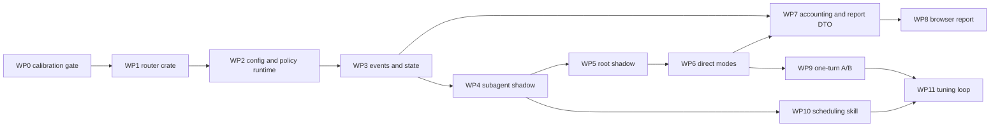

# Automatic Model Router — Implementation Plan

Status: Ready for staged implementation
Depends on: [Automatic Model Router — Design](model-router.md)

## 1. Outcome

Deliver an optional local model router that classifies every eligible root or
subagent task, selects a provider/model/reasoning-effort route, exposes all five
configured modes, and makes every decision and its cost visible. The implementation
is complete only when direct and shadow routing, accounting, the browser report,
one-turn subagent A/B mode, and the scheduling skill work together.

Arctic Embed XS through FastEmbed/ONNX is the selected embedding backbone. The
historical classifier-labelled corpus provides provisional calibration input and
held-out benchmarks remain visible calibration evidence. They never disable an
explicitly selected direct routing mode: in `full`, the router always makes the
eligible routing decision. Optional approval governs whether that decision is applied
immediately.

## 2. Fixed constraints

- `Feature::ModelRouter` gates the whole feature; `mode = "off"` is the operational
  default.
- The public mode set is exactly `off`, `shadow-subagents`, `shadow-full`,
  `subagents`, and `full`.
- Explicit user route choices and safety policy outrank automatic routing.
- Automatic root routes are per-turn. They must not overwrite the user's persistent
  orchestrator route, which remains the fallback and A/B branch-B route.
- Root steering does not create a routing decision. Only input that starts a new
  regular turn is classified.
- Root and subagent decisions use the same bounded normalizer, embedding artifact,
  classifier, policy revision, and route validator.
- No prompt, output, or reversible prompt fragment enters the policy or metrics
  database. Store hashes, bounded metadata, decisions, usage, and aggregates.
- Model artifacts are pinned, checksummed, installed explicitly, and never downloaded
  while a turn is starting.
- Policy reload is atomic and retains the last valid revision on failure.
- Route decisions are transcript-visible but not model-visible.
- Every provider-reported usage record is attributed or explicitly counted as
  unattributed. Missing usage or prices produce `unknown`, never zero.
- Changes remain in reviewable slices below the repository's change-size guidance.
- This plan assumes no new unit or snapshot tests. Validation uses the historical
  benchmark, scoped builds/lints/schema generation, and narrow manual behavior checks
  unless the user separately authorizes test investment.

## 3. Landing zones

| Responsibility | Primary location |
|---|---|
| Embedding, classifier, policy, decision types | New `xedoc-rs/model-router` crate |
| Stable controls and feature gate | `features`, `config`, and `core-config` |
| Root-turn host adapter | `core/src/session/handlers.rs` and `session/turn_context.rs` |
| Subagent host adapter | `core/src/tools/handlers/multi_agents_v2/spawn.rs` plus a new focused routing module |
| Process-wide router and provider-client resolution | `core/src/state/service.rs` plus new focused modules |
| Decision and invocation persistence | New `state/src/model_router.rs` and state migrations |
| Rollout/client event | `protocol`, `app-server-protocol`, and app-server event mapping |
| Slash command and compact decision cells | `tui-completion`, `tui-chatwidget`, `tui-events`, and `tui` |
| Report RPC and static site | New app-server request processor and report-server modules |
| Built-in scheduling skill | `skills/src/assets/samples/<skill-name>/` |

Do not put classifier or reporting logic in `xedoc-core`. Core owns only the adapters
needed to intercept turn and spawn boundaries. Keep new functionality out of the
already-large TUI orchestration modules by adding focused sibling modules.

## 4. Dependency order

WP0–WP3 establish one versioned decision contract. WP4 and WP5 exercise it without
changing model selection. WP6 enables all five modes without requiring elapsed shadow
time. The feature remains experimental through WP9, when spend is auditable and paired
tuning is usable.

## 5. Cross-cutting contracts

### 5.1 Task and decision

`TaskEnvelope` contains scope, bounded prompt view, current orchestrator route, explicit
override state, and parent/A/B metadata where applicable. The router returns one
`RouteDecision` containing:

- stable decision, thread, and turn IDs plus a closed root/subagent lineage enum;
- a closed classified/failed outcome carrying class, score, and margin when classified;
- classifier/policy/artifact revisions and elapsed time;
- proposed, effective, orchestrator, fallback, and reporting-baseline routes;
- disposition and a closed machine-readable reason enum;
- prompt hash, original byte count, and truncation flag.

The host, not the classifier, applies precedence and creates the effective route. One
route helper validates the provider/model pair and reasoning effort against the live
catalog before either root or subagent integration uses it.

### 5.2 Runtime ownership

Create one lazy `ModelRouterService` per app-server/CLI process and share it with all
threads. It owns:

- a bounded dedicated worker for synchronous ONNX inference;
- the loaded artifact and its verified identity;
- an atomically replaceable last-good policy snapshot;
- bounded health and latency counters.

Classification must not block an async executor thread. A full queue, worker failure,
invalid policy, or unavailable route returns a visible fallback decision.

Root provider switching also requires a provider-aware model-client resolver. The
current session-scoped client is correct only for the persistent session provider.
Resolve or cache a client by effective provider for each turn, while reusing one client
session within that turn. Do not mutate the persistent orchestrator configuration to
make an automatic route work.

### 5.3 Persistence

Add one migration after the current state schema with four tables:

- `model_router_decisions`: immutable classification/application facts;
- `model_router_invocations`: exact provider usage and price snapshots linked to a
  decision when applicable;
- `model_router_ab_outcomes`: pair identity and explicit preference/tie/unusable
  signal;
- `model_router_daily`: idempotent UTC aggregates rebuilt from complete raw days.

Use separate provider, model, effort, token, price, and nullable cost columns so report
queries do not parse route JSON. Include cached input separately. Raw retention folds
complete days before pruning. Idempotency keys include thread, turn, response, and
invocation kind. Report unknown-price and missing-usage coverage.

## 6. Work packages

### WP0 — Reproducible classifier gate

Scope:

- move the privacy-preserving historical extractor into a maintained calibration
  command;
- freeze corpus cutoff, prompt hashes, class definitions, split algorithm, and random
  seed in a benchmark manifest;
- train and compare deterministic linear heads over frozen Arctic embeddings;
- retain cue-masked, chronological held-out, per-class recall, top-two recall,
  abstention coverage, cost-weighted errors, latency, RSS, and artifact checks;
- keep operations outside learned routes until the corpus supports them, with an
  explicit strong-model floor.

Before reading held-out results, record numerical pass/fail gates and the asymmetric
penalty for under-routing strong-model work. If the gate fails, refine labels or
taxonomy and produce another manifest revision; do not weaken the gate after seeing
results.

Exit evidence: a reproducible aggregate report, a serialized classifier proposal, and
a reviewed `model-router.toml` proposal. Raw prompts remain only in local memory.

### WP1 — Router crate and artifact loader

Scope:

- add workspace member/package `xedoc-model-router` with a small public API;
- implement bounded normalization, hashing, Arctic embedding, the WP0-selected
  classifier, confidence/margin gates, and deterministic decisions;
- load only a local model directory, verify revision/dimensions/hash, and reject
  partial or remote artifacts;
- run inference through the dedicated bounded worker;
- add an inspection command that prints health and aggregate decision diagnostics
  without printing prompt text.

Dependency work: pin FastEmbed/ORT, update Cargo and Bazel locks together, and prove
the artifact/package strategy for Linux, macOS, Windows, and release signing.

Exit evidence: the same prompt and policy reproduce the same route, offline startup
cannot trigger a download, and bounded single-prompt latency/RSS stay within the WP0
gate.

### WP2 — Configuration and policy activation

Scope:

- add `ModelRouterMode`, baseline route, fallback, policy path, prompt bound, report
  public URL, and feature configuration;
- register `Feature::ModelRouter` and materialize the effective config;
- parse the separate `~/.xedoc/model-router.toml` into versioned policy types;
- atomically activate a reviewed policy and retain the previous valid snapshot;
- detect a changed policy before an eligible task and reload it without restarting;
- expose service health, active revision, artifact identity, and last reload error.

`/model-router mode` must use the existing app-server-backed config write path so the
file and active TUI agree. Mode changes apply to the next eligible task, never an
in-flight one.

Exit evidence: config schema regeneration succeeds; malformed policies leave the last
good policy active and produce an actionable status.

### WP3 — Decision event and durable state

Scope:

- add `ModelRouterDecisionEvent` without changing `ModelRerouteEvent`;
- map it to an experimental app-server v2 notification;
- persist the same decision contract in the rollout and state database;
- add a non-blocking compact TUI history cell for live and replayed decisions;
- add state APIs for decision insertion, invocation insertion, bounded recent reads,
  rollup, and aggregate reads.

Treat the new raw event and resumed-rollout shape as external compatibility surfaces.
Keep all event fields bounded and avoid optional fields in `EventMsg` variants.

Exit evidence: one synthetic decision survives rollout replay and state projection and
renders identically from the app-server notification path.

### WP4 — Subagent shadow routing

Scope:

- classify the final `spawn_agent` message after it is validated and before child
  configuration is finalized;
- distinguish caller model/effort overrides, role-pinned routes, configured defaults,
  and inherited values so explicit choices remain authoritative;
- apply the shared route validator but keep the original effective child route in
  `shadow-subagents`;
- carry the decision ID into the child through spawn metadata/extension state;
- emit and persist fallback reasons for artifact, classifier, policy, catalog, and
  effort failures.

Keep V1 behavior unchanged. Integrate MultiAgentV2 first because its prompt and route
override boundary is explicit in `multi_agents_v2/spawn.rs`.

Exit evidence: `off` emits nothing; `shadow-subagents` emits a proposed route while the
child starts with its pre-router provider/model/effort.

### WP5 — Root shadow routing and provider clients

Scope:

- separate "apply thread settings" from "construct a new turn context" in the user
  input handler;
- attempt active-turn steering without classification;
- only after `NoActiveTurn`, normalize the accepted user input and request a route;
- build an ephemeral routed session/config snapshot for the new `TurnContext`;
- select base instructions, model metadata, provider capabilities, service tier, and
  model client from that effective route;
- retain the persistent orchestrator route for the next task, fallback, status, and
  A/B branch B.

This stage introduces the provider-aware model-client resolver before any root route
can be applied. Record route switches because they can invalidate prompt-cache reuse.

Exit evidence: `shadow-full` classifies root and subagent tasks, steering does not, and
the persistent model picker remains unchanged.

### WP6 — Direct subagent and root modes

Scope:

- apply the proposed route only when the mode includes the task scope and the WP0
  classifier gate is satisfied;
- make `subagents` apply only child routes and `full` apply both root and child routes;
- preserve explicit overrides, safety reroutes, service-tier compatibility, and
  provider/model identity;
- always execute the fallback route when a decision cannot safely apply.

Direct application and shadow must call the same decision path; only the final
disposition differs. Do not maintain separate shadow heuristics.

Exit evidence: all five modes match the mode table, a cross-provider root turn uses the
correct client without changing the orchestrator selection, and no failure in routing
prevents a valid fallback turn.

### WP7 — Exact usage, baseline, and report DTO

Scope:

- attribute regular and auxiliary provider completions at their existing usage
  recording points, where `TurnContext`, provider, model, and prices are known;
- persist non-cached input, cached input, output, actual price snapshot, calculated
  cost, baseline price snapshot, normalized baseline, and nullable savings;
- link child usage directly through decision IDs rather than reconstructing it from
  parent totals;
- expose bounded experimental `modelRouterReport/read` aggregates and recent decisions;
- distinguish observed A/B deltas from counterfactual baseline estimates.

Reuse pricing semantics from `SessionCostTracker`, but do not use its per-model
session totals as the reporting source because those totals lose invocation and
decision identity.

Exit evidence: report sums reconcile with attributed raw rows; unknown prices remain
null; auxiliary calls and both A/B branches contribute to actual spend.

### WP8 — App-server-hosted browser report

Scope:

- add a lazy `ReportServer` owned by the app-server and stopped by its cancellation
  token;
- bind `127.0.0.1:0` for local processes, or require an explicitly configured HTTPS
  browser URL for remote use;
- add experimental `modelRouterReport/open` returning a short-lived read-only
  capability URL;
- ship a static HTML/CSS/JavaScript site with no CDN and bounded JSON queries;
- add summary, daily cost/tokens, class/route/scope, confidence/fallback/cache, A/B,
  recent-decision, and incomplete-accounting views;
- wire `/model-router report [days]` to the RPC and existing browser-open event.

Put the token in the URL fragment and send it only as a request header. Apply
`no-store`, restrictive CSP/referrer headers, origin checks, expiry, pagination, and
date bounds. Add static assets to app-server Bazel `compile_data`.

Exit evidence: the report opens from embedded and standalone local app-server modes;
remote mode either returns its configured HTTPS URL or an actionable limitation.

### WP9 — One-turn A/B subagent pairs

Scope:

- add per-thread runtime state for `ab next`/`ab off`; consume it exactly once when a
  new root turn starts;
- capture the parent orchestrator route at that root-turn boundary;
- reserve capacity for two leaf children before spawning either;
- send byte-identical task messages to branch A (routed) and branch B (orchestrator),
  with branch identity carried only in transport metadata;
- return both canonical task names and pair ID to the parent;
- record explicit routed/orchestrator/tie/unusable preference through a bounded
  root-only outcome tool or equivalent runtime signal.

Read-only pairs run with write permissions removed. Write-capable pairs require two
distinct registered execution environments/worktrees supplied as spawn isolation
metadata; otherwise the router records an ineligible pair and spawns the ordinary
single task. Operations and deployment tasks are not duplicated automatically.

Exit evidence: no partial pair is created, children cannot recurse, branch costs are
observed separately, and failure to prove write isolation cannot duplicate effects.

### WP10 — Scheduling-focused orchestration skill

Use the `skill-creator` workflow to add a built-in skill derived from
`orchestrating-bounded-research` and `implement-with-evidence`. Its contract:

1. define the evidence boundary and final artifact;
2. decompose into bounded tasks with dependencies and output contracts;
3. label read/write scope and parallel-safety;
4. schedule only dependency-ready work within concurrency/spend limits;
5. provide complete prompts without ordinary model overrides;
6. establish A/B isolation metadata for write tasks;
7. integrate results and schedule review, PR finalization, or deployment only when
   the parent task calls for them;
8. stop when the requested outcome is complete.

Exit evidence: prompts produced by the skill reach the router unchanged, and routing
remains correct when the skill is absent or routing is off.

### WP11 — Calibration and mapping tuning loop

Scope:

- aggregate A/B preference, cost, latency, confidence deciles, fallbacks, overrides,
  and class drift;
- generate reviewable policy revisions with route/effort/threshold or taxonomy changes;
- compare proposals against the frozen held-out set plus newer drift samples;
- activate only an explicitly reviewed revision and keep rollback atomic.

Exit evidence: a tuning run can propose, inspect, activate, and roll back a policy
without rebuilding Xedoc or silently mutating the active mapping.

## 7. Validation and merge gates

For every work package:

- inspect the diff against the design and the package's exit evidence;
- run `just fmt` after source changes;
- run `just fix -p <changed-package>` for large Rust changes;
- use scoped Bazel build/lint targets, not Cargo build/check/test;
- run `just write-config-schema` after config shape changes;
- run `just write-app-server-schema --experimental` and update
  `app-server/README.md` after protocol changes;
- run `just bazel-lock-update` and `just bazel-lock-check` with dependency changes;
- verify Linux, macOS, and Windows build/package coverage for FastEmbed/ORT;
- bump the workspace version on each `main` merge that ships binary code, following
  the repository's Conventional Commit rule.

Manual end-to-end matrix before removing the experimental label:

| Case | Required observation |
|---|---|
| Missing/corrupt artifact | visible fallback; turn succeeds |
| Invalid policy update | last-good revision remains active |
| Explicit root or child route | router records `explicit`; route is unchanged |
| Root steering | no routing decision |
| Shadow modes | proposal visible; effective route unchanged |
| Direct modes | only selected scopes change route |
| Cross-provider root route | correct provider client; orchestrator selection unchanged |
| Unknown usage/price | tokens or coverage gap shown; cost is not zero |
| A/B read task | two leaf children, same prompt, separate observed costs |
| A/B write task without isolation | one ordinary child; visible ineligible reason |
| Embedded report | loopback capability URL opens |
| Remote report without public URL | bounded read RPC works; open reports limitation |

## 8. Rollout and rollback

- Land every work package behind `Feature::ModelRouter`; do not expose partial direct
  behavior merely because a mode enum exists.
- Keep `mode = "off"` when upgrading an existing installation.
- Policy and model problems roll back by atomically restoring the previous policy or
  artifact revision; code rollback is not required.
- State migrations are additive. Older binaries may ignore the new tables, and report
  readers tolerate rows from newer policy revisions.
- Direct routing has a kill switch at both feature and mode level. Reporting remains
  readable when routing is off.

## 9. Definition of done

- The WP0 held-out classifier evidence and its manifest are reproducible.
- All five modes obey one precedence and fallback implementation.
- Root routing supports provider changes without changing persistent user selection.
- Every decision is visible in TUI/app-server and replayable without entering model
  context.
- Reported usage, prices, actual cost, normalized baseline, savings, and A/B overhead
  reconcile with stored invocation rows, including auxiliary calls.
- `/model-router report` opens the bounded app-server-hosted web UI.
- One-turn A/B mode is leaf-only, capacity-safe, and effect-safe.
- The built-in orchestration skill schedules dependency-ready bounded prompts without
  duplicating routing policy.
- Policy tuning is reviewable, explicit, reversible, and does not require a rebuild.
